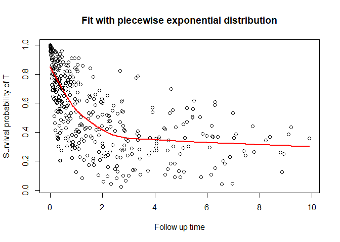

<!-- README.md is generated from README.Rmd. Please edit that file -->

# CureDepCens

<!-- badges: start -->
<!-- badges: end -->

Cure dependent censoring regression models for long-term survival
multivariate data.

## Installation

You can install the development version of CureDepCens from
[GitHub](https://github.com/) with:

``` r
install.packages("devtools")
devtools::install_github("GabrielGrandemagne/CureDepCens")
```

## Example

This is a basic example which shows you how to solve a common problem:

``` r
library(devtools)
#> Carregando pacotes exigidos: usethis
library(CureDepCens)
load_all()
#> ℹ Loading CureDepCens
Dogs_MimicData <- Dogs_MimicData
delta_t = ifelse(Dogs_MimicData$cens==1,1,0)
delta_c = ifelse(Dogs_MimicData$cens==2,1,0)

# MEP
fit <- cure_dep_censoring(formula = time ~ x1_cure + x2_cure | x_c1 + x_c2,
                           data = Dogs_MimicData,
                           delta_t = delta_t,
                           delta_c = delta_c,
                           ident = Dogs_MimicData$ident,
                           dist = "mep")
summary_cure(fit)
#> 
#> MEP approach
#> 
#> Name  Estimate    Std. Error  CI INF      CI SUP      p-value     
#> Alpha    2.034930    0.2005083   1.641933    2.427926    3.044e-26   
#> Theta    0.7787554   0.4238412   0.000000    1.609484    
#> 
#> Coefficients Cure:
#> 
#> Name  Estimate    Std. Error  CI INF      CI SUP      p-value     
#> Interc   -0.6976047  0.1781988   -1.046874   -0.3483351  7.141e-33   
#> x1_cur   0.514533    0.1703999   0.1805492   0.8485168   7.419e-18   
#> x2_cur   0.2017428   0.08103922  0.04290593  0.3605797   0.001578    
#> 
#> Coefficients C:
#> 
#> Name  Estimate    Std. Error  CI INF      CI SUP      p-value     
#> x_c1 0.03219111  0.1625781   -0.286462   0.3508442   0.1122  
#> x_c2 -0.318467   0.1609394   -0.6339082  -0.003025754    4.682e-12   
#> 
#> ----------------------------------------------------------------------------------
#> 
#> Information criteria:
#> 
#> AIC   BIC      HQ    
#> 510.9032 574.7666 536.194
```

*Dogs_MimicData* is our simulated data frame. For more information check
the documentation for stored datasets.

``` r
head(Dogs_MimicData)
#>            u          v         t          c      time event int x1_cure
#> 1 0.56788087 0.83359383 0.4131564  0.3614745 0.3614745     0   1       0
#> 2 0.66013804 0.72909631 1.0968927  2.1033648 1.0968927     1   1       1
#> 3 0.06854872 0.63332194       Inf  1.6510975 1.6510975     0   1       1
#> 4 0.88345952 0.57152197 0.6522436  8.6456149 0.6522436     1   1       1
#> 5 0.45431855 0.92452776 0.9258282  0.5216269 0.5216269     0   1       1
#> 6 0.12120571 0.02350277       Inf 10.9070711 5.1121398     0   1       1
#>      x2_cure       x_c1 x_c2 cens ident
#> 1  0.5228382  1.0403070    0    2     1
#> 2 -0.4207129  0.1071675    1    1     2
#> 3 -1.1207319 -1.4042911    0    2     3
#> 4  1.1764416 -0.7740067    1    1     4
#> 5  0.3891404  0.4973770    1    2     5
#> 6  0.5580893 -0.2278904    1    3     6
```

You can also plot the survival function

``` r
plot_cure(fit, scenario = "t")
```


